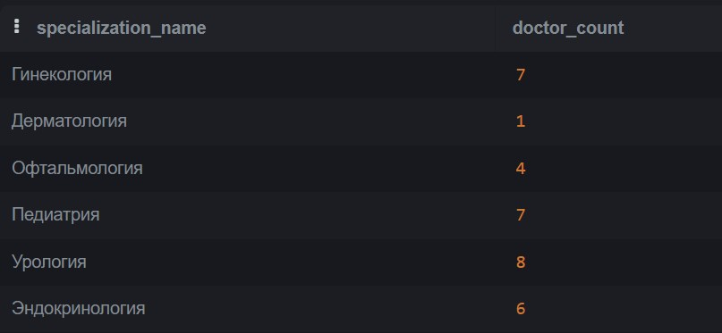

## Примеры SQL-запросов


* [Структура базы данных, для которой написаны примеры запросов](./for_sql_pgsql.md)
* [ER-диаграмма](./erd_for_sql.png)


**1. Найти количество врачей в каждой специальности.**

```sql
SELECT "Specialization".name AS specialization_name, COUNT("Doctor".id) AS doctor_count
FROM "Doctor" 
JOIN "Specialization" ON "Doctor".specialization_id = "Specialization".id
GROUP BY "Specialization".name;
```


* * *

**2. Вывести всех пациентов женского пола, у которых группа крови B+.**

```sql
SELECT id, last_name, name, middle_name, gender_name, blood_type  
FROM "Patient" 
WHERE blood_type = 'B+' AND gender_name = 'Женский'
```


* * *


**3. Найти максимальное количество проведённых консультаций для одного пациента.***

```sql
SELECT Consult.patient_id, COUNT(Consult.id) AS closed_consultations_count
FROM "Consultation" Consult
JOIN "StatusConsultation" Status ON Consult.status_id = Status.id
WHERE Status.status_name = 'Закрыта'
GROUP BY Consult.patient_id
ORDER BY closed_consultations_count DESC
LIMIT 1; 
```


* * *


**4. Определить наиболее востребованные специализации врачей: сколько слотов забронировано у врачей каждой специализации, вывести топ 3.**

```sql
SELECT Spec.name, COUNT(Slots.id) As reserved_slots
From "Specialization" Spec
JOIN "Doctor" Doc on Doc.specialization_id = Spec.id
JOIN "Slots" Slots ON Slots.doctor_id = Doc.id
JOIN "StatusSlot" Status On Status.id = Slots.status_id
WHERE Status.status_name = 'Занят'
GROUP By Spec.id
ORDER BY reserved_slots DESC
LIMIT 3;
```


* * *


**5. Анализ средней оценки консультаций по каждому врачу: посчитать среднее и вывести 5 врачей с самым низким рейтингом.**

```sql
SELECT CONCAT( Doc.last_name, Doc.name ) AS doctor_name, AVG(Review.rating) as avg_rate, COUNT(Consult.id) AS consult_number
From "Consultation" Consult
JOIN "Review" Review ON Consult.review_id = Review.id
JOIN "Slots" Slots ON Consult.slot_id = Slots.id
JOIN "Doctor" Doc On Doc.id = Slots.doctor_id
GROUP By Doc.id
ORDER BY avg_rate
LIMIT 5;
```


* * *


**6. Определить загрузку врачей: посчитать количество занятых слотов, вывести 5 самых загруженных врачей.**

```sql
SELECT CONCAT( Doc.last_name, Doc.name ) as doctor, COUNT(Slots.id) as reserved_slots
FROM "Slots" Slots
JOIN "StatusSlot" Status ON Status.id = Slots.status_id
JOIN "Doctor" Doc On Doc.id = Slots.doctor_id
WHERE Status.status_name = 'Занят'
GROUP By Doc.id
ORDER BY reserved_slots DESC
LIMIT 5;
```


* * *


**7. Процент консультаций в разных статусах от общего числа.**


```sql
SELECT Status.status_name, 100*COUNT(Consult.id) / 
(SELECT COUNT (*) FROM "Consultation") AS percent_of_consultations
FROM "StatusConsultation" Status
LEFT JOIN "Consultation" Consult ON Status.id = Consult.status_id
GROUP BY Status.id;
```


* * *

