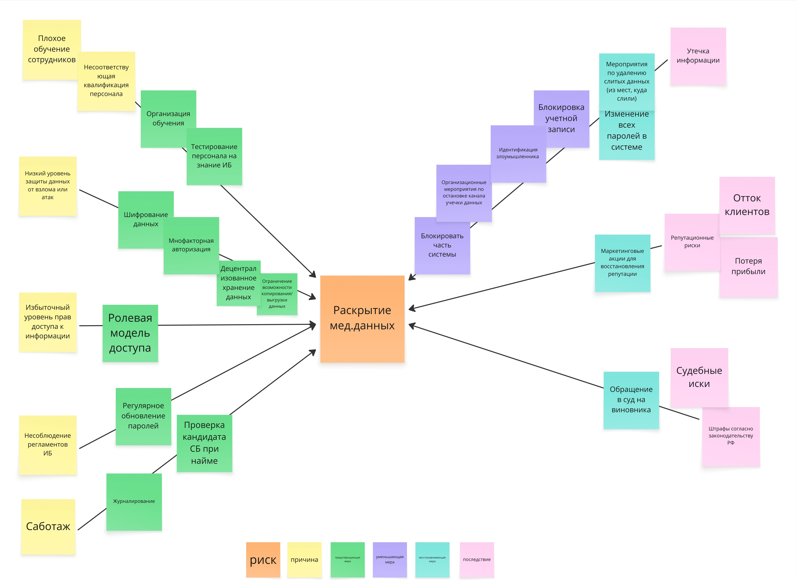

## Риски

|Риск|Причина|Последствие|
|-|-|-|
|**Несанкционированный доступ к ИС и/или данным**|Несоответствующая квалификация персонала; низкий уровень защиты данных от взлома или атак; избыточный уровень прав доступа к информации| Утечка информации; блокировка доступа к ИС; искажение информации; снижение производительности работы ИС|
|**Раскрытие персональных данных**|Несоответствующая квалификация персонала; низкий уровень защиты данных от взлома или атак; избыточный уровень прав доступа к информации|Штрафы согласно законодательству РФ; отток клиентов; испорченная репутация; судебные иски|
|**Раскрытие медицинских данных**|Несоответствующая квалификация персонала; низкий уровень защиты данных от взлома или атак; избыточный уровень прав доступа к информации|Штрафы согласно законодательству РФ; отток клиентов; испорченная репутация; судебные иски|
|**Потеря данных**|Несоответствующая квалификация персонала; низкий уровень защиты данных от взлома или атак; избыточный уровень прав доступа к информации; отсутствие бекапов системы|Потеря клиентской базы; потеря данных работы компании; конфликты с клиентами; штрафы согласно законодательству РФ|
|**Потеря доступности ИС**|Несоответствующая квалификация персонала; низкий уровень защиты данных от взлома или атак; избыточный уровень прав доступа к информации; отсутствие балансировки нагрузки|Потеря прибыли; испорченная репутация|
|**DoS, DDoS атаки**|Низкий уровень защиты данных от взлома или атак|Снижение производительности работы ИС; сбой работы ИС; потеря прибыли; испорченная репутация|

### Оценка риска раскрытия медицинских данных

