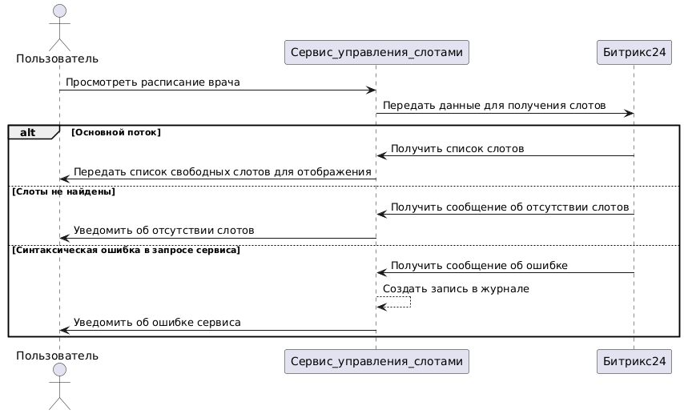

## UC-4.1 Получить слоты врача из Битрикс24

**ID:** UC-4.1

**Название:** Получить слоты врача из Битрикс24

**Участники:** Пользователь, Сервис управления слотами, Битрикс24

**Предусловия:** -

**Триггер:** -

**Постусловие:** -

**Основной поток:**
1. Пользователь дает команду просмотреть расписание врача
2. Сервис управление слотами передает данные для получения слотов в Битрикс24:
 - идентификатор врача
 - дата начала диапазона слотов
 - дата окончания диапазона слотов
3. Сервис управления слотами получает список слотов от Битрикс24 со следующими параметрами:
 - id слота
 - id врача
 - дата
 - время начала
 - время окончания
 - статус
 - id пациента
 - id консультации
4. Сервис управления слотами отображает Пользователю слоты со значением атрибута: ```[Слот]:статус = "Свободен"```
5. Сценарий окончен

**Расширение:**

3а. Слоты не найдены

  3а1. Сервис управления слотами получает от Битрикс24 сообщение об отсутствии слотов

  3а2. Сервис управления слотами уведомляет Пользователя об отсутствии слотов

  3а3. Сценарий окончен

3б. Синтаксическая ошибка в запросе сервиса

  3б1. Сервис управления слотами получает от Битрикс24 сообщение об ошибке в запросе

  3б2. Сервис управления слотами создаёт запись об ошибке в журнале

  3б3. Сервис управления слотами уведомляет Пользователя об ошибке сервиса

  3б4. Сценарий окончен


**Диаграмма последовательности**



```
@startuml
actor       Пользователь       as Пользователь
Пользователь -> Сервис_управления_слотами: Просмотреть расписание врача
Сервис_управления_слотами -> Битрикс24: Передать данные для получения слотов
alt Основной поток
Битрикс24 -> Сервис_управления_слотами: Получить список слотов
Сервис_управления_слотами -> Пользователь: Передать список свободных слотов для отображения
else Слоты не найдены
Битрикс24 -> Сервис_управления_слотами: Получить сообщение об отсутствии слотов
Сервис_управления_слотами -> Пользователь: Уведомить об отсутствии слотов
else Синтаксическая ошибка в запросе сервиса
Битрикс24 -> Сервис_управления_слотами: Получить сообщение об ошибке
Сервис_управления_слотами --> Сервис_управления_слотами: Создать запись в журнале
Сервис_управления_слотами -> Пользователь: Уведомить об ошибке сервиса
end

@enduml
```
